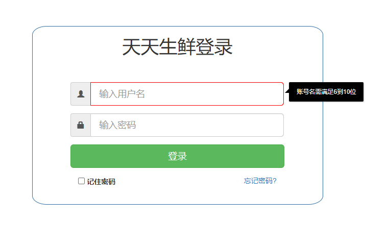
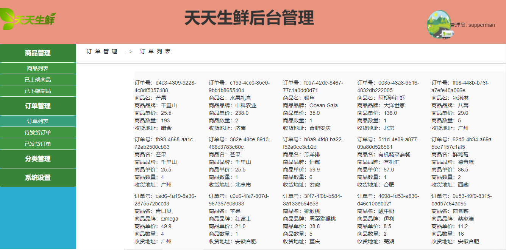
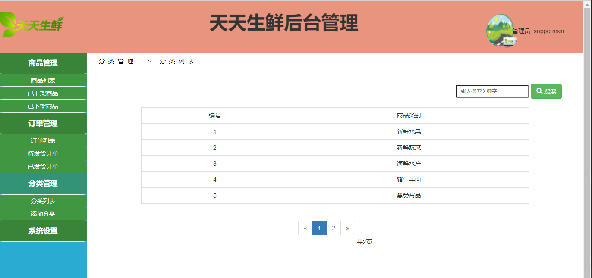
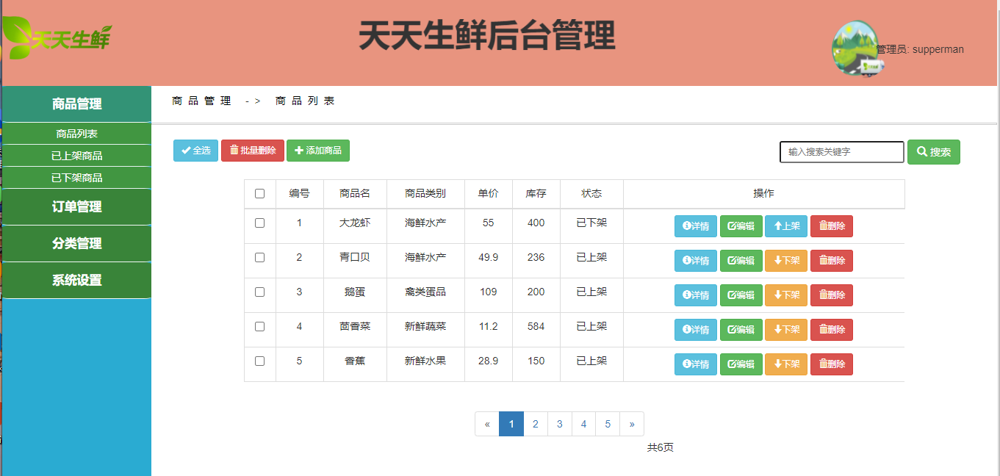
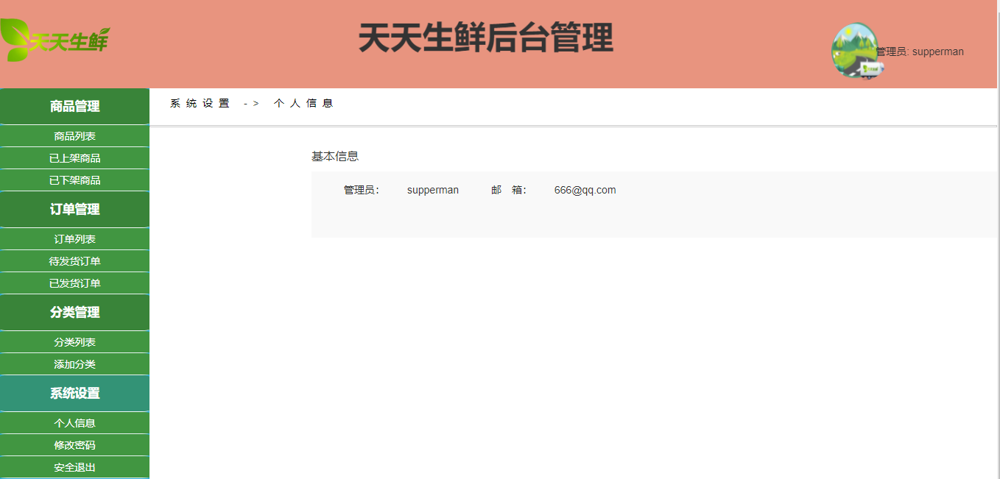
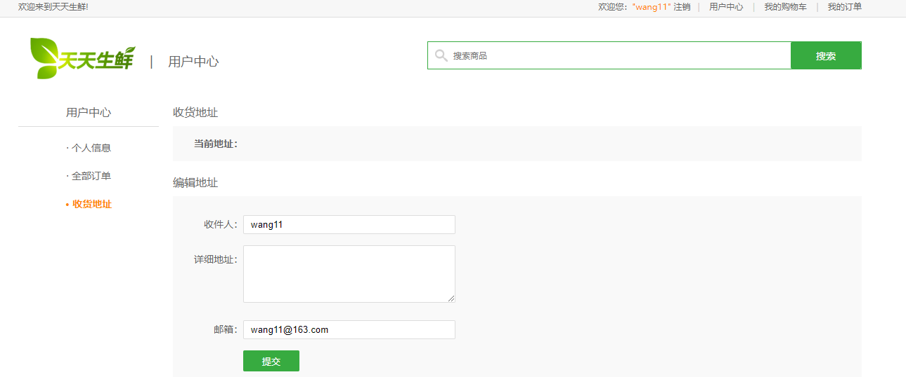

基于Springboot的生鲜水果商城
=
### 完整代码获取地址：从戎源码网 ([https://armycodes.com/](https://armycodes.com/))
### 作者微信：19941326836  QQ：952045282 
### 承接计算机毕业设计、Java毕业设计、Python毕业设计、深度学习、机器学习
### 选题+开题报告+任务书+程序定制+安装调试+论文+答辩ppt 一条龙服务
### 所有选题地址https://github.com/nature924/allProject

一、项目介绍
---
基于SpringBoot框架的生鲜水果商城，有用户和管理员两个角色，主要功能如下
生鲜水果商城的功能简介如下：

### 【用户】
1. 生鲜购买：用户可以浏览商城中的生鲜水果商品
2. 生鲜商品分类展示：商品按照分类展示
3. 购物车：用户可以将心仪的商品添加到购物车中
4. 用户中心：用户可以查看自己的订单信息、收货地址、个人资料等，并进行相应的管理和修改。

### 【管理员】
1. 商品管理：管理员有权限管理商品列表，包括添加新商品、编辑商品信息、上架商品和下架商品。
2. 订单管理：管理员可以查看订单列表，并筛选待发货订单和已发货订单
3. 分类管理：管理员可以管理商品的分类，包括添加、编辑和删除分类

二、项目技术
---
- 编程语言：Java
- 数据库：MySQL
- 项目管理工具：Maven
- 前端技术：VUE、HTML、Jquery、Bootstrap
- 后端技术：Spring、SpringMVC、MyBatis

三、运行环境
---
- 操作系统：Windows、macOS都可以
- JDK版本：JDK1.8以上都可以
- 开发工具：IDEA、Ecplise、Myecplise都可以
- 数据库: MySQL5.7以上都可以
- Tomcat：任意版本都可以
- Maven：任意版本都可以

四、运行截图
---

### 程序截图：

